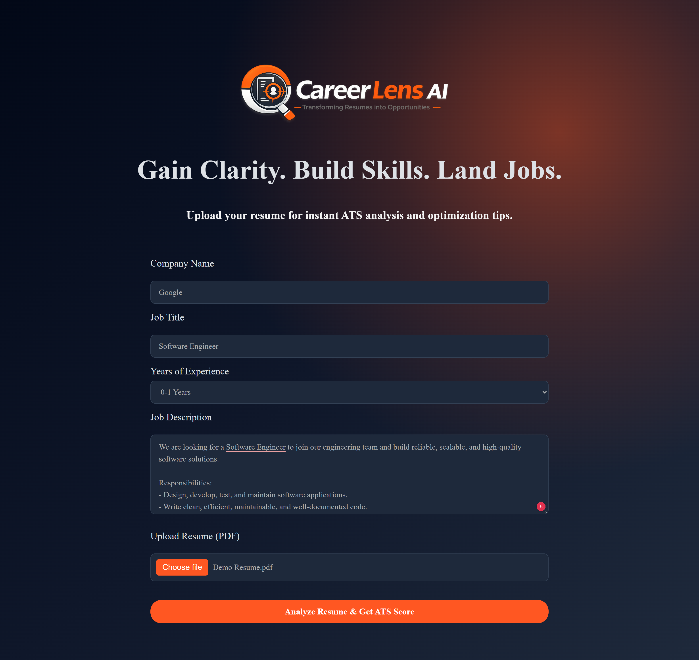
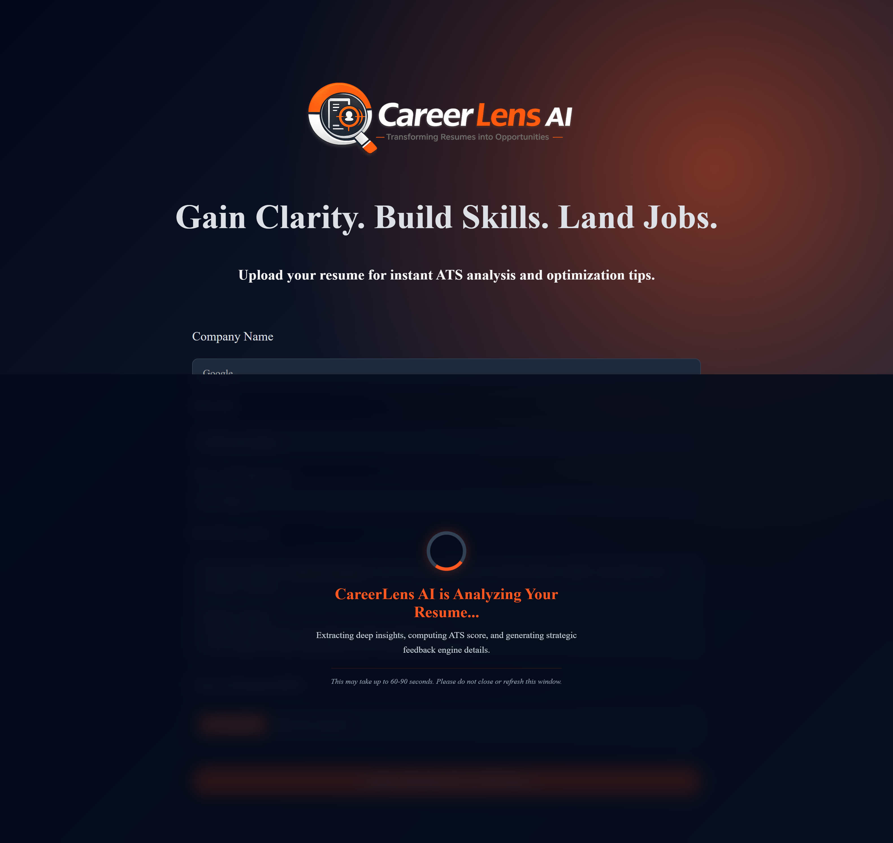
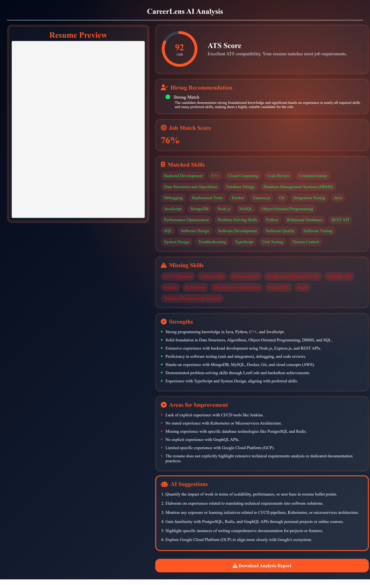

# CareerLens AI

### Transforming Resumes into Opportunities

CareerLens AI is an AI-powered resume analysis and job matching platform that helps candidates understand how well their resume matches a specific job description.

The application analyzes a candidate's resume against a provided job description, calculates an ATS score, identifies matched and missing skills, provides an AI-generated hiring recommendation, and generates personalized resume improvement suggestions.

It also stores uploaded resumes using Cloudinary and allows users to download a structured PDF analysis report.

---

## 🚀 Features

- 📄 Upload resume in PDF format
- 🤖 AI-powered resume and job description analysis
- 📊 ATS compatibility score
- 🎯 Job match percentage
- ✅ Matched skills detection
- ⚠️ Missing skills detection
- 💪 Strength identification
- 📌 Areas for improvement
- 🧑‍💼 AI-generated hiring recommendation
- 💡 Personalized AI suggestions
- ☁️ Cloudinary resume storage
- 📑 Resume preview
- 📥 Downloadable PDF analysis report
- 📱 Responsive user interface
- 🔐 Environment-based configuration

---

## 🧠 How It Works

```text
User
 │
 │ Resume + Job Description
 ▼
Frontend
 │
 │ Multipart Request
 ▼
Node.js + Express Backend
 │
 ├── Upload Resume
 │       └── Cloudinary
 ├── Extract Resume Text
 ├── Extract & Match Skills
 ├── Calculate ATS Score
 └── Generate AI Analysis
 │
 ▼
Analysis Result
 │
 ├── ATS Score
 ├── Job Match %
 ├── Matched Skills
 ├── Missing Skills
 ├── Strengths
 ├── Weaknesses
 ├── AI Suggestions
 └── Hiring Recommendation
 │
 ▼
Analysis Dashboard
 │
 ▼
Downloadable PDF Report
```

---

## 🛠️ Technology Stack

### Frontend
- HTML5
- CSS3
- JavaScript
- Font Awesome
- jsPDF

### Backend
- Node.js
- Express.js
- Multer
- pdf-parse

### Artificial Intelligence
- Google Gemini API

### Cloud Storage
- Cloudinary

### Development & Deployment
- Git
- GitHub
- Vercel
- Render

---

## 📂 Project Structure

```text
CareerLens AI/
│
├── Backend/
│   ├── config/
│   │   ├── cloudinary.js
│   │   └── gemini.js
│   ├── controllers/
│   │   └── analysisController.js
│   ├── middleware/
│   │   └── uploadMiddleware.js
│   ├── routes/
│   │   └── analysisRoutes.js
│   ├── services/
│   │   ├── aiAnalysisService.js
│   │   ├── atsScoringService.js
│   │   ├── cloudinaryService.js
│   │   ├── resumeParserService.js
│   │   └── skillMatchingService.js
│   ├── .env
│   ├── package.json
│   └── server.js
│
├── Frontend/
│   ├── images/
│   │   └── CareerLensAI.png
│   ├── css/
│   │   ├── main.css
│   │   └── review.css
│   ├── js/
│   │   ├── main.js
│   │   ├── review.js
│   │   └── report.js
│   ├── index.html
│   └── review.html
│
├── screenshots/
│   ├── home-page.png
│   ├── loading-page.png
│   └── analysis-result.png
│
├── reports/
│   └── CareerLens_Analysis_Report.pdf
│
└── README.md
```

> Do not commit your real `Backend/.env` file or API keys to GitHub.

---

# 🔍 Core Modules

## 1. Resume Upload

Users can upload their resume in PDF format. The application validates required fields, PDF file type, and a maximum file size of 5 MB.

The backend receives the resume using Multer memory storage.

## 2. Resume Text Extraction

The uploaded PDF is processed using `pdf-parse` to extract its textual content.

The extracted text is used for skill identification, ATS evaluation, job matching, and AI analysis.

CareerLens AI currently works best with text-based PDF resumes. Scanned or image-only PDFs may require OCR support.

## 3. AI Skill Matching

Google Gemini analyzes the resume and job description to identify relevant technical and professional skills.

The system identifies resume skills, job-required skills, matched skills, and missing skills.

Skill names are normalized where appropriate.

Examples:

```text
JS → JavaScript
Node → Node.js
REST APIs → REST API
Postgres → PostgreSQL
```

## 4. ATS Score

CareerLens AI calculates an ATS score using multiple resume characteristics, including contact information, resume sections, technical skills, projects, action-oriented language, resume length, and job relevance.

The final score is displayed on a scale of 0–100.

> The ATS score is a project-specific scoring methodology and is not an official score used by employers.

## 5. Job Match Percentage

The application calculates the percentage of relevant job-description skills that are also present in the resume.

```text
Job Match % =
Matched Skills
----------------------------- × 100
Matched Skills + Missing Skills
```

## 6. AI-Powered Resume Analysis

Gemini generates personalized feedback based on the actual resume and job description.

The analysis includes strengths, weaknesses, improvement suggestions, hiring recommendation, and recommendation reason.

The AI is instructed not to invent experience, skills, certifications, or achievements.

## 7. Cloudinary Resume Storage

Uploaded resumes are stored using Cloudinary.

After successful upload, the backend returns a secure Cloudinary URL that is used by the frontend to display the uploaded resume in the analysis dashboard.

## 8. Downloadable PDF Report

CareerLens AI generates a structured PDF report using jsPDF.

The report contains:

- ATS score
- Job match score
- Hiring recommendation
- Hiring analysis summary
- Matched skills
- Missing skills
- Strengths
- Areas for improvement
- AI suggestions

The report is generated directly in the browser.

---

# 🖥️ Application Preview

## 1. Home Page

The home page allows users to enter the target company, job title, experience level, job description, and upload their resume.



## 2. Loading Page

After clicking **Analyze Resume & Get ATS Score**, CareerLens AI processes the uploaded resume and generates the analysis.



## 3. Analysis Result

The analysis dashboard displays the ATS score, job match percentage, hiring recommendation, matched skills, missing skills, strengths, weaknesses, and AI suggestions.



---

# 📄 Sample PDF Report

A sample generated CareerLens AI analysis report is included in the repository.

**[View / Download Sample Analysis Report](reports/CareerLens_Analysis_Report.pdf)**

The sample report demonstrates the final PDF output generated by the application.

---

# ⚙️ Installation & Setup

## Prerequisites

- Node.js
- npm
- Git
- Google Gemini API key
- Cloudinary account

## 1. Clone the Repository

```bash
git clone https://github.com/z2zohashaikhh/ai-resume-analyzer-job-match.git
cd ai-resume-analyzer-job-match
```

## 2. Install Backend Dependencies

```bash
cd Backend
npm install
```

## 3. Configure Environment Variables

Create a `.env` file inside the `Backend` directory:

```env
PORT=5000

GEMINI_API_KEY=your_gemini_api_key

CLOUDINARY_CLOUD_NAME=your_cloudinary_cloud_name
CLOUDINARY_API_KEY=your_cloudinary_api_key
CLOUDINARY_API_SECRET=your_cloudinary_api_secret

FRONTEND_URL=http://localhost:5502
```

Never commit the `.env` file to GitHub.

## 4. Start the Backend

From the `Backend` directory:

```bash
node server.js
```

The backend runs on:

```text
http://localhost:5000
```

## 5. Run the Frontend

Open the `Frontend` folder using VS Code Live Server.

The frontend can run on a local address such as:

```text
http://127.0.0.1:5502
```

Make sure `Frontend/js/main.js` points to the correct backend URL.

---

# 🔐 Environment Variables

| Variable | Purpose |
|---|---|
| `PORT` | Backend server port |
| `GEMINI_API_KEY` | Google Gemini API key |
| `CLOUDINARY_CLOUD_NAME` | Cloudinary cloud name |
| `CLOUDINARY_API_KEY` | Cloudinary API key |
| `CLOUDINARY_API_SECRET` | Cloudinary API secret |
| `FRONTEND_URL` | Allowed frontend origin |

---

# 🌐 Deployment

CareerLens AI uses a separate frontend and backend deployment architecture.

### Frontend
The static frontend can be deployed using **Vercel**.

### Backend
The Node.js/Express backend can be deployed using **Render**.

### Resume Storage
Uploaded resumes are stored using **Cloudinary**.

After deployment, update the API URL in:

```text
Frontend/js/main.js
```

to point to the deployed backend.

---

# 🔄 Application Flow

```text
Enter Job Details
        ↓
Upload Resume
        ↓
Validate Resume
        ↓
Send Resume to Backend
        ↓
Upload Resume to Cloudinary
        ↓
Extract Resume Text
        ↓
Extract & Match Skills
        ↓
Calculate ATS Score
        ↓
Generate AI Analysis
        ↓
Return Results
        ↓
Display Analysis Dashboard
        ↓
Generate PDF Report
```

---

# 📊 Example Analysis Output

```text
ATS Score: 82 / 100

Job Match: 67%

Matched Skills:
- Java
- Python
- SQL
- JavaScript
- REST API
- Git
- Docker

Missing Skills:
- Kubernetes
- GraphQL
- Redis
- TypeScript
- CI/CD

Recommendation:
Moderate Match
```

The actual results depend on the resume and job description submitted by the user.

---

# 🎯 Project Objective

CareerLens AI aims to help students, fresh graduates, and job seekers understand the gap between their current resume and the requirements of a target job.

Instead of providing only an ATS score, the platform provides actionable insights about:

- Existing matching skills
- Missing skills
- Resume strengths
- Areas for improvement
- Personalized AI suggestions
- Job-specific resume alignment

---

# 🚧 Current Limitations

- Resume text extraction currently depends on text-based PDF files.
- Scanned or image-only resumes may require OCR.
- AI analysis depends on Gemini API availability.
- ATS scoring uses a project-specific scoring methodology.
- Job matching depends on the quality and completeness of the provided job description.

---

# 🔮 Future Enhancements

- OCR support for scanned resumes
- AI-powered resume rewriting
- Multiple resume comparison
- Job recommendation based on skills
- LinkedIn profile analysis
- Resume version management
- Advanced ATS scoring
- Additional AI-powered career insights

---

# 👩‍💻 Author

**Zoha Shaikh**

CareerLens AI — AI-Powered Resume Analysis & Job Matching Platform